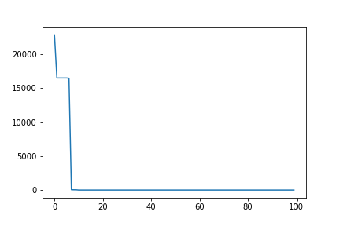

# metaheuristics-benchmark
Python3 framework for comparative study of recent metaheuristics

* **Free software:** MIT license
* **Python versions:** 3.7.x, 3.8.x, 3.9.x, 3.10.x
* **Dependencies:** numpy, matplotlib

# Goals

Our goals are
- To implement some of the classical as well as the state-of-the-art metaheuristics.
- To implement the IEEE-CEC benchmark functions set.
- Create a simple interface that helps researchers, practitioners and students access optimization algorithms as quickly as possible, evaluate their performances against most common metaheuristics and share knowledge of the optimization field with everyone without a fee.

# Usage

## Example

```python
from functions import *
from metaheuristics import *


cost = Rastrigin(dim=12) 
model = whale_optimization(cost)
best_agent, cost_best_agent, costs = model.optimize()
```

### Get Visualize Figures
```python
model.plot()
```
<p align="center">
  
</p>

# Functions

We tried to implement all functions of the IEEE-CEC-2017 benchmark functions, <a src="https://github.com/P-N-Suganthan/CEC2017-BoundContrained">listed here</a>

# Optimization algorithms
For now, available metaheuristics optimization algorithms are
- Simulated Annealing
- Differential Evolution
- Grey Wolf Optimizer
- Whale Optimization
- Equilibrium Optimizer

More are coming soon.

# Custom Problem
Follow the problems model defined in functions.py\
For instance the sum of squared function $x\in \mathbb{R}^d \mapsto \sum_{i=1}^{d} x_i^2$ can be defined as follows :

```python
class custom_problem:
    name = "custom_problem"
    separable = False # not mandatory

    def __init__(self, d): # only the attribute d is mandatory, you can add if needed
        self.d = d
        self.input_domain = np.array([[-100, 100] for _ in range(d)]) # CEC default search domain

    def get_param(self): # dictionnary of parameters
        return {}

    def get_global_minimum(self):
        X = np.array([0 for _ in range(d)]) # if a solution of the problem is known...
        return (X, self(X))

    def __call__(self, X): # here is the behaviour of the function when it is call
        return sum(X**2)
 ```
